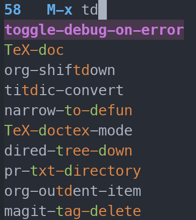
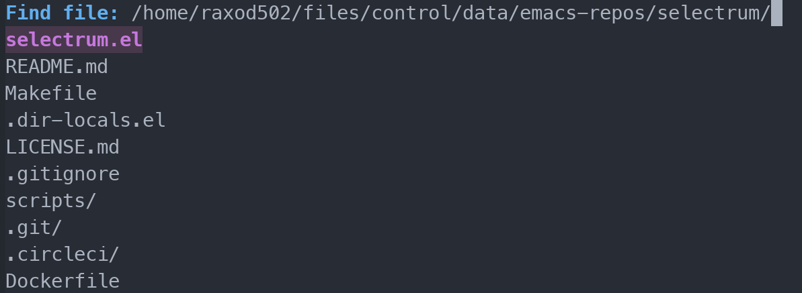
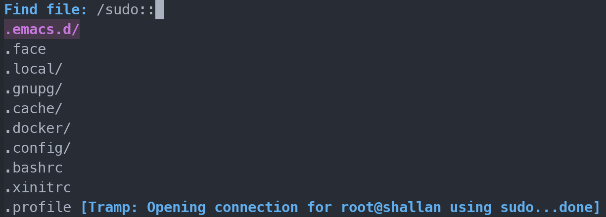
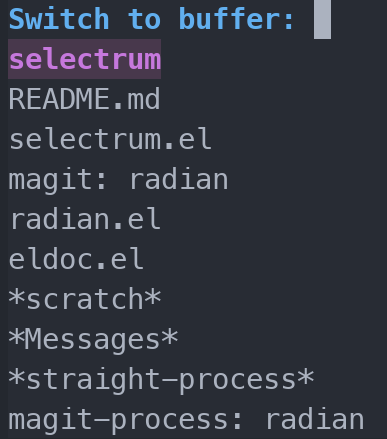
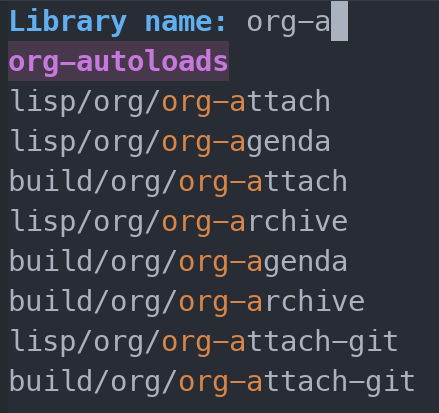

# Selectrum

*Selectrum is a better solution for incremental narrowing in Emacs,
replacing [Helm](https://github.com/emacs-helm/helm),
[Ivy](https://github.com/abo-abo/swiper#ivy), and
[IDO](https://www.gnu.org/software/emacs/manual/html_node/ido/index.html)*.

<!-- toc -->

- [What is it?](#what-is-it)
- [Getting started](#getting-started)
- [User guide](#user-guide)
  * [Keybindings](#keybindings)
  * [Sorting and filtering](#sorting-and-filtering)
  * [Customization](#customization)
  * [But what is it doing to my Emacs??](#but-what-is-it-doing-to-my-emacs)
- [Developer guide](#developer-guide)
  * [Usage of Selectrum](#usage-of-selectrum)
  * [Sorting, filtering, and highlighting](#sorting-filtering-and-highlighting)
  * [Text properties](#text-properties)
  * [Hooks](#hooks)
- [Caveats](#caveats)
- [Why use Selectrum?](#why-use-selectrum)
  * [Why not IDO?](#why-not-ido)
  * [Why not Helm?](#why-not-helm)
  * [Why not Ivy?](#why-not-ivy)
  * [Why not Icicles?](#why-not-icicles)

<!-- tocstop -->

## What is it?

Selectrum provides an interface for selecting items from a list. You
can use it to run a command with `M-x`:

<p align="center">  </p>

You can use it to open a file with `C-x C-f` (`find-file`):

<p align="center">  </p>

Even [TRAMP](https://www.gnu.org/software/tramp/#Quick-Start-Guide)
works great out of the box:

<p align="center">  </p>

You can switch buffers:

<p align="center">  </p>

And every other command in Emacs is automatically enhanced, without
the need for any configuration:

<p align="center">  </p>

## Getting started

Selectrum is not currently listed on MELPA. Therefore, the best way to
install it is with
[`straight.el`](https://github.com/raxod502/straight.el):

```elisp
(straight-use-package
  '(selectrum :host github :repo "raxod502/selectrum"))
```

To enable Selectrum, simply add to your init-file:

```elisp
(selectrum-mode +1)
```

Now all of your favorite Emacs commands will automatically use
Selectrum. However, the default sorting and filtering is very basic.
It is recommended to use
[`prescient.el`](https://github.com/raxod502/prescient.el) to enable
more intelligent sorting and filtering. Simply add this to your
init-file:

```elisp
(straight-use-package
  '(selectrum-prescient :host github :repo "raxod502/prescient.el"
                        :files ("selectrum-prescient.el")))

;; to make sorting and filtering more intelligent
(selectrum-prescient-mode +1)

;; to save your command history on disk, so the sorting gets more
;; intelligent over time
(prescient-persist-mode +1)
```

## User guide

The design philosophy of Selectrum is to be as simple as possible,
because selecting an item from a list really doesn't have to be that
complicated, and you don't have time to learn all the hottest tricks
and keybindings for this. What this means is that Selectrum always
prioritizes consistency, simplicity, and understandability over making
optimal choices for workflow streamlining. The idea is that when
things go wrong, you'll find it easy to understand what happened and
how to fix it.

### Keybindings

* *To navigate to a candidate:* use the standard motion commands
  (`<up>`, `<down>`, `C-v`, `M-v`, `M-<`, `M->`). If you prefer, you
  can use `C-p` and `C-n` instead of the arrow keys.
* *To accept the currently selected candidate:* type `RET`.
* *To submit what you've typed, even if it's not a candidate:* type
  `C-j`.
* *To abort:* as per usual, type `C-g`.
* *To navigate into the currently selected directory while finding a
  file\:* type `TAB`. (What this actually does is insert the currently
  selected candidate into the minibuffer, which for `find-file` has
  the effect of navigating into a directory.)

Selectrum respects your custom keybindings, so if you've bound
`next-line` to `M-*` for some reason, then pressing `M-*` will select
the next candidate. If you don't like the standard Selectrum bindings,
you can change them by customizing `selectrum-minibuffer-bindings`,
and your changes will take effect right away.

The keybindings listed above are the *only* ones changed from standard
editing bindings. So, for example:

* All your standard horizontal motion, selection, insertion, and
  deletion commands work as usual.
* To delete your current input, just use `C-a C-k`.
* To go up a directory, use `M-DEL` to delete it in the minibuffer.
* To navigate to your home directory, you can just use `C-a C-k ~/`.

### Sorting and filtering

The default sorting and filtering in Selectrum is quite primitive.
First candidates are sorted alphabetically, and then they are filtered
down to those that contain your input as a substring. The part of each
candidate that matches your input is highlighted. This default
behavior is intended as a lowest common denominator that will
definitely work.

However, it is strongly recommended that you set up
[`prescient.el`](https://github.com/raxod502/prescient.el) in order to
get more intelligent sorting and filtering. (See the "getting started"
section for how to do this.) With `prescient.el`:

* Your most recent choices are saved, and those are sorted first.
  After that, your most frequent choices are saved, and those are
  sorted next. The rest of the candidates are sorted by length. This
  algorithm turns out to do very well in practice while being fast and
  not very magical.
* Your input is split on spaces into subqueries, each of which must
  match as either a substring or an initialism (e.g. `ffap` matches
  `find-file-at-point`) in order for a candidate to be included.
  Again, this algorithm isn't optimal, but it does very well in
  practice given its simplicity and speed.
* The part of each candidate that matched your input is highlighted,
  with the initials of an initialism highlighted in a second color.

It is possible to supply your own sorting, filtering, and highlighting
logic if you would like. For that, see the developer guide later in
this documentation.

Selectrum adds two special features on top of whatever sorting and
filtering is selected:

* If your input matches one of the candidates exactly, then that
  candidate is unconditionally sorted first. (So, if you type in
  `find-file`, then `ido-find-file` will never be sorted before
  `find-file`, no matter what.) This is intended to reduce frustration
  in the case that you know what you want and you don't want Selectrum
  getting in the way.
* After that, if the caller of Selectrum specified a default candidate
  (for example, `describe-function` suggests the function near point
  as a default) then that candidate will be sorted before the rest.
  This means you can just press `RET` immediately to accept the
  default, like usual.

Selectrum doesn't have any special handling of case-sensitivity,
because Emacs includes a system for this by default. The command `M-x
toggle-case-fold-search` toggles globally between case-sensitive
matching and case-insensitive matching.

### Customization

* By default, ten candidates are shown in the minibuffer at any given
  time. You can customize that by changing
  `selectrum-num-candidates-displayed`.
* The currently selected candidate is highlighted with the face
  `selectrum-current-candidate`. If you don't like the color, you can
  adjust it to taste.
* By default, the part of each candidate that matches your input is
  highlighted with the face `selectrum-primary-highlight`. There is
  also `selectrum-secondary-highlight`, which is not used by default
  but is provided for other packages that may use more complex
  highlighting schemes (such as `prescient.el`).

As an example of customizing the faces, I use the
[Zerodark](https://github.com/NicolasPetton/zerodark-theme) color
theme, which includes colors for Ivy, but not for Selectrum. I
inspected the theme source code to see what colors were being used for
Ivy, and copied them to be used for Selectrum as well:

```elisp
(require 'zerodark-theme)

(let ((class '((class color) (min-colors 89))))
  (custom-theme-set-faces
   'zerodark
   `(selectrum-current-candidate
     ((,class (:background "#48384c"
                           :weight bold
                           :foreground "#c678dd"))))
   `(selectrum-primary-highlight ((,class (:foreground "#da8548"))))
   `(selectrum-secondary-highlight ((,class (:foreground "#98be65"))))))

(enable-theme 'zerodark)
```

### But what is it doing to my Emacs??

By inspecting the source code of `selectrum-mode`, you will see that
Selectrum operates by setting a number of standard Emacs variables
(`completing-read-function`, `read-file-name-function`, etc.) and
installing advice on a number of standard function
(`read-library-name`, `minibuffer-message`, etc.).

If you object to these changes being made magically, you can make them
yourself and refrain from enabling `selectrum-mode`. All of the
functions and advice installed by Selectrum are part of the public
API.

The autoloads of Selectrum are set up so that you can enable
`selectrum-mode` without actually loading Selectrum. It will only be
loaded once you use some of its functionality in an interactive
command.

## Developer guide

This section is intended for the authors of packages which integrate
with Selectrum, or for end users who wish to customize the sorting and
filtering behavior of Selectrum.

### Usage of Selectrum

Selectrum provides a single entry point to its main functionality, the
function `selectrum-read`. This function is rather like
`completing-read`, but with a cleaner API. See the docstring for
details. The various functions and advice installed by Selectrum just
call into `selectrum-read` with various arguments, after translating
whatever Emacs API they implement into Selectrum's least common
denominator.

Unless you are extending Selectrum to support some very weird function
which (ab)uses the `completing-read` framework in an interesting way,
you shouldn't need to use `selectrum-read` directly, as all Emacs
functions should call into it as appropriate when `selectrum-mode` is
enabled.

### Sorting, filtering, and highlighting

Selectrum exposes a very simple API for sorting, filtering, and
highlighting. Each of these three tasks is controlled by a separate
user option:

* `selectrum-preprocess-candidates-function` takes the original list
  of candidates and sorts it (actually, it can do any sort of
  preprocessing it wants). This preprocessing only happens once.
* `selectrum-refine-candidates-function` takes the preprocessed list
  and filters it using the user's input (actually, it can produce the
  final list of candidates however it wants, including generating it
  on the fly). This refinement happens every time the user input is
  updated.
* `selectrum-highlight-candidates-function` takes a list of the
  refined candidates that are going to be displayed in the minibuffer,
  and propertizes them with highlighting.

For exact specifications of these functions, including whether or not
the input list may be modified, please see their docstrings. This
information is important, because if you make copies of the candidate
list unnecessarily, there will be noticeable lag due to the slowness
of Emacs' garbage collector.

### Text properties

What has been described so far suffices for most cases. However, some
types of candidate selection (in particular, `find-file`) are more
complex. This complexity is minimized by abstracting the essential
requirements of the `find-file` implementation into a simple API.

The API is based primarily on the following three text properties,
which may be applied to candidates using `propertize`:

* `selectrum-candidate-display-prefix`: controls how the candidate is
  displayed in the list shown in the minibuffer. If this property is
  present, then its value is prepended to the candidate when it is
  displayed. This is used, for example, to display disambiguating
  parent directories in `read-library-name`.
* `selectrum-candidate-display-suffix`: same as the display prefix,
  but it's postpended instead of prepended when the candidate is
  dispalyed. This is used, for example, to display a trailing slash on
  directories in `find-file`.
* `selectrum-candidate-full`: controls how the candidate appears in
  the user input area of the minibuffer. If this property is present,
  then it specifies the canonical representation of the candidate.
  This is the value that will be returned from `selectrum-read`. It is
  also the value that will be inserted when the user presses `TAB`. In
  `find-file`, the canonical representation of each candidate is its
  absolute path on the filesystem.

Note that sorting, filtering, and highlighting is done on the standard
values of candidates, before any of these text properties are handled.

There is one final detail: the `selectrum-refine-candidates-function`
may return, in addition to the refined list of candidates, a
transformed user input which will be used for highlighting (for
`find-file`, this is the basename of the file in the user input).

To really understand how these pieces work together, it is best to
inspect the source code of `selectrum-read-buffer` and
`selectrum-read-file-name` (an effort has been made to make the code
readable). Note that both of these functions operate by temporarily
rebinding `selectrum-candidate-preprocess-function` and
`selectrum-candidate-refine-function` in order to generate candidates
on the fly and then sort and filter them using the original values of
these functions.

### Hooks

Selectrum provides two hooks for getting information about what
candidates were selected. These are intended primarily for packages
like `prescient.el` which want to record history statistics. The hooks
are:

* `selectrum-candidate-selected-hook`
* `selectrum-candidate-inserted-hook`

For more information, see their docstrings.

## Caveats

* There is no support for multiple selection or alternate actions.
  This is unlikely to ever change, because supporting these features
  requires violating the `completing-read` abstraction rather
  aggressively, and that goes against Selectrum's design philosophy of
  simplicity and consistency.
* Recursive minibuffers are not currently supported. This is because
  such support would complicate the implementation significantly
  (currently all state is stored in a small set of global variables,
  and this scheme would need to be replaced with some kind of stack).
  I am not necessarily opposed to adding recursive minibuffer support
  if it can be done relatively cleanly and somebody points out a
  concrete use case that benefits from the support.
* In Emacs 25, `M-x ffap` is basically completely broken. This is
  because in old versions of Emacs, `ffap` worked by calling
  `completing-read` directly with a special completion table function,
  rather than just using `read-file-name` like would be reasonable.
  Since Emacs 25 is going to die eventually, I'm not going to bother
  fixing this, although pull requests would be accepted.

## Why use Selectrum?

This section documents why I decided to write Selectrum instead of
using any of the numerous existing solutions in Emacs.

### Why not IDO?

[IDO](https://www.gnu.org/software/emacs/manual/html_node/ido/index.html)
is a package for interactive selection that is included in Emacs by
default. It's a great improvement on the default `completing-read`
experience. However, I don't like how it displays candidates in a
horizontal instead of a vertical manner. It feels less intuitive to
me. Furthermore, IDO is still integrated with the default
`completing-read` framework, which means it doesn't take full
advantage of a new UI paradigm.

### Why not Helm?

[Helm](https://github.com/emacs-helm/helm) is an installable package
which provides an alternate vertical interface for candidate
selection. It has the advantage of having very many features and a
large number of packages which integrate with it. However, the problem
with Helm for me is exactly that it has too many features. Upon
opening a Helm menu, I am immediately confronted by numerous colors,
diagnostics, options, and pieces of help text. It is too complicated
for the problem I want solved.

### Why not Ivy?

[Ivy](https://github.com/abo-abo/swiper#ivy) is the most promising
alternative to Selectrum, and it's what I used before developing
Selectrum. It is marketed as a minimal alternative to Helm which
provides a simpler interface. The problem with Ivy is its
architecture, API, and implementation, all of which are very poorly
designed. Ivy was originally designed to be used as a backend to
[Swiper](https://github.com/abo-abo/swiper#swiper), a buffer search
package that originally used Helm. Unfortunately, when Ivy became a
more general-purpose interactive selectrum package, its abstractions
were not reworked to make sense in this new context. Over time, more
and more special cases were added to try to make various commands work
properly, and not nearly enough effort has been put in to making the
core functionality consistent and correct. As a result, the `ivy-read`
API has around 20 arguments and a heap of special cases for particular
values (which are completely undocumented). Numerous functions in Ivy,
[Counsel](https://github.com/abo-abo/swiper#counsel), and Swiper have
special cases hardcoded into them to detect when they're being called
from specific other functions *in the other two packages*. As a result
of all this, Ivy is incredibly flaky and full of edge-case bugs like
[this one](https://github.com/abo-abo/swiper/issues/1632). It is these
bugs and quirks in UX that led me to develop Selectrum.

Fundamentally, selecting an item from a list *is not a complicated
problem*, and it *does not require a complicated solution*. That's why
Selectrum is around 900 lines of code even though Ivy+Counsel (which
do basically the same thing) are around 11,000 lines together.
Selectrum achieves its conciseness by:

* working with the existing Emacs APIs for completion, rather than
  replacing all of them and then reimplementing every Emacs command
  that uses them (incidentally, this also reduces the number of bugs
  and inconsistencies)
* preferring simplicity and consistency over the "best" possible UX
  for each individual command (which also makes it easier to
  understand what Selectrum is doing and work around the sharp
  corners)
* designing the best possible interface for candidate selection from
  the ground up, rather than repurposing an API that was used for
  something else and then just sticking new things onto it every time
  a bug appears

In addition, Selectrum does not support multiple selection or
alternate actions, unlike Ivy. This is because supporting either of
these features means you need to throw out the existing
`completing-read` API, which is an absolutely massive time-sink and
source of bugs that adds very little to the user experience. Selectrum
works with *every* Emacs command with approximately no special cases,
specifically because it focuses on doing the common case as well as
possible.

As a final note, when you're using `selectrum-prescient.el`, there's
an easy way to simulate Ivy's alternate actions. Suppose you've typed
`M-x` and found the command you want, but now you realize you want to
look up the documentation instead. Press `TAB` to insert the
candidate, which has the side effect of placing it at the top of the
recency table in `prescient.el`. Then `C-g` out of Selectrum and type
`C-h f`. The same command will automatically be at the top of the
list, so you can get the documentation just by pressing `RET`. I
believe that this sort of idea can be extended to get all of the
utility out of these extra features without actually implementing
explicit support for them (with all of the attendant complexity and
bugs).

### Why not Icicles?

[Because it's maintained on EmacsWiki, enough
said.](https://github.com/melpa/melpa/pull/5008)
